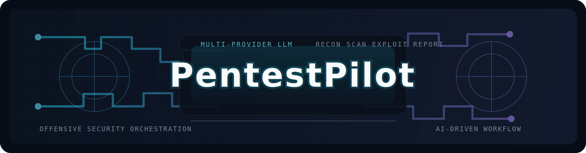

<p align="center">
  
</p>

<p align="center">
  <b>AI-Powered Autonomous Penetration Testing Framework</b>
</p>

<p align="center">
  <a href="./README_CN.md">中文文档</a> | English
</p>

<p align="center">
  
  
  
</p>

---

> **WARNING: This tool is strictly for authorized penetration testing only. Using this tool against targets without explicit written authorization is illegal. Users bear full legal responsibility for any misuse.**

## What is PentestPilot?

PentestPilot is an AI-driven penetration testing framework with multi-provider LLM support. It uses a **ReAct (Reason + Act)** agent architecture to autonomously execute the full pentest lifecycle — from reconnaissance to exploitation to reporting. It currently supports Anthropic, MiniMax via Anthropic-compatible API, and reserves configuration for multiple OpenAI-compatible vendors including OpenAI, Gemini, Groq, xAI, Together, Fireworks, Mistral, DeepSeek, and OpenRouter-style gateways.

## Development Status (April 2026)

> PentestPilot is still under active development. It is usable for authorized labs / internal testing, but it is not yet a fully stable “one-click solve everything” product.

### Implemented Modules (currently usable)

| Module Area | Status | Current Capability |
|-------------|--------|--------------------|
| `core/llm.py` + `config.yaml` | Implemented | Multi-provider runtime (Anthropic / MiniMax CN / MiniMax Global / OpenAI-compatible endpoints) |
| `core/agent.py` + `core/planner.py` | Implemented | ReAct loop, phase planning/replanning, tool dispatch, failure retry |
| `core/state_machine.py` + `core/memory.py` | Implemented | Session lifecycle, findings persistence, SQLite long-term memory |
| `knowledge/ingest.py` + `knowledge/retriever.py` | Implemented | OWASP seed ingestion + ChromaDB retrieval-augmented context |
| `modules/reporter.py` | Implemented | Markdown + HTML report generation from live or persisted sessions |

### Tools with higher confidence (usable now)

| Category | Tools |
|----------|-------|
| Recon / Surface Baseline | `nmap_scan`, `python_port_scan`, `httpx_probe`, `dirbust`, `dirsearch_init` |
| SQLMap Runtime / Direct Operations | `sqlmap_init`, `sqlmap_scan_url`, `sqlmap_enumerate_databases`, `sqlmap_enumerate_tables`, `sqlmap_enumerate_columns`, `sqlmap_dump_table`, `sqlmap_get_banner`, `sqlmap_get_current_user`, `sqlmap_get_current_db`, `sqlmap_read_file`, `sqlmap_execute_command` |
| Reporting / Session Artifacts | `generate_report`, `sessions`, `report` |

### Near-term roadmap

- `page_intel`
- `http_request`, `login_form`, `upload_file`
- `sqli_scan` (agent-level wrapper behavior and convergence)
- `ssrf_scan` (new async engine needs wider target validation)
- `xss_scan` (context handling and dynamic verification still tuning)
- `nuclei_scan`, `onedaypoc_scan`, `subdomain_enum`, `python_vuln_check`
- `jwt_analyze`, `extract_jwt_from_response`, `hash_crack`

### Known Gaps (being improved)

- Planner convergence can still drift on some CTF/lab targets and over-call generic scans.
- High-risk confirmation prompts may still appear repeatedly in some exploit paths.
- Browser-assisted verification depends on optional environment/tooling and may be unavailable in some setups.

## Key Features

- **Multi-Provider LLM Layer** — Brain / Planner / Ask / Exploit / Post-Exploit all use a unified provider config, so you can switch between Anthropic, MiniMax, and other compatible vendors in `config.yaml`
- **Direct Execution Model** — Scans and MCP tool calls now execute directly, so scope control and legal authorization must be handled by the operator
- **Single Agent + Parallel Tool Execution** — ReAct loop powered by a single agent, with `ThreadPoolExecutor` for concurrent tool dispatch. Balances reasoning coherence with execution speed
- **Dynamic Planning & Recovery** — Planner generates phase-specific execution plans (parallel groups / sequential steps). On failure, Replanner auto-adjusts strategy with up to 2 retries
- **RAG-Enhanced Decisions** — ChromaDB knowledge base (ships with OWASP Top 10) provides contextual reference for agent decision-making
- **Pure Python Fallbacks** — Every external binary tool (nmap, nuclei, httpx) has a pure Python implementation. Zero-dependency out-of-the-box
- **MCP Server** — Exposes all tools via Model Context Protocol for direct use in Claude Code / IDE
- **Plugin System** — ToolRegistry with auto-discovery of built-in tools + external plugin directory loading

## Architecture

```
┌─────────────────────────────────────────────────────────┐
│                     Input Router                         │
│              scan | ask | tools | report                 │
└────────┬──────────────────┬─────────────────────────────┘
         │                  │
    [Scan Task]        [Knowledge Query]
         │                  │
         v                  v
┌─────────────────┐  ┌──────────────┐
│   Planner (RAG) │  │  Knowledge   │
│  Phase planning  │  │  Agent (RAG) │
└────────┬────────┘  └──────────────┘
         │
         v
┌─────────────────────────────────────┐
│          ReAct Agent Loop            │
│                                     │
│  Brain (LLM Provider) ──> Parallel Tools│
│       ^                  │          │
│       └── Observations <─┘          │
│                                     │
│  Failure → Replanner → Retry        │
└────────┬────────────────────────────┘
         │
         v
┌─────────────────────────────────────┐
│  Phase State Machine                 │
│  INIT → RECON → SCAN → EXPLOIT →    │
│  POST_EXPLOIT → REPORT → DONE       │
└─────────────────────────────────────┘
         │
         v
    Report Output (Markdown + HTML)
```

## Project Structure

```
pentestpilot/
├── main.py                 # CLI entry point (Input Router)
├── mcp_server.py           # MCP Server (Claude Code integration)
├── config.yaml             # Global configuration
├── install.sh              # One-click installer
├── pyproject.toml          # Dependency management
│
├── core/                   # Core engine
│   ├── agent.py            # ReAct main loop + parallel tool execution
│   ├── brain.py            # Provider interaction (streaming + multi-tool calls)
│   ├── config.py           # config.yaml / .env loader
│   ├── llm.py              # Multi-provider adapter layer
│   ├── planner.py          # Dynamic planner + Replanner
│   ├── memory.py           # Short-term context + SQLite long-term persistence
│   └── state_machine.py    # Pentest phase state machine
│
├── tools/                  # Tool layer
│   ├── registry.py         # Tool registry (auto-discovery + plugin loading)
│   ├── nmap_tool.py        # Port scanning (nmap + Python fallback)
│   ├── httpx_tool.py       # Web probing (httpx + Python fallback)
│   ├── nuclei_tool.py      # Vulnerability scanning (nuclei + Python fallback)
│   ├── xss_tool.py         # XSS detection (reflected + DOM)
│   ├── sqli_tool.py        # SQL injection detection (sqlmap)
│   ├── ssrf_tool.py        # SSRF + open redirect detection
│   ├── subdomain_tool.py   # Subdomain enumeration (DNS + crt.sh)
│   ├── dirbust_tool.py     # Directory bruteforce
│   ├── jwt_tool.py         # JWT security analysis
│   └── pure/               # Pure Python implementations (zero external deps)
│       ├── port_scanner.py # Async port scanner
│       ├── vuln_checker.py # Rule-based vulnerability checker
│       └── onedaypoc.py    # 1-day CVE PoC fingerprinting
│
├── modules/                # Feature modules
│   ├── recon.py            # Reconnaissance orchestration
│   ├── web_scan.py         # Web scanning orchestration
│   ├── exploit_gen.py      # Exploit generation
│   ├── post_exploit.py     # Post-exploitation
│   └── reporter.py         # Report generation (Markdown + HTML)
│
├── knowledge/              # RAG knowledge base
│   ├── ingest.py           # Knowledge ingestion (OWASP / CVE / Markdown)
│   ├── seeds/              # Built-in knowledge seed bundles (data files, not hardcoded Python)
│   └── retriever.py        # Vector retrieval interface
│
├── db/                     # SQLite database (session persistence)
└── reports/                # Report output directory
```

## Quick Start

### 1. Install

```bash
# One-click install (recommended)
chmod +x install.sh && ./install.sh

# Or manual install
pip install anthropic openai python-dotenv rich typer httpx jinja2 pyyaml chromadb "mcp[cli]"
```

### 2. Set API Key

```bash
# Pick one provider you want to use
export ANTHROPIC_API_KEY="sk-ant-..."
export MINIMAX_API_KEY="your-minimax-key"
export OPENAI_API_KEY="your-openai-key"
export GEMINI_API_KEY="your-gemini-key"
export GROQ_API_KEY="your-groq-key"
export XAI_API_KEY="your-xai-key"
export TOGETHER_API_KEY="your-together-key"
export FIREWORKS_API_KEY="your-fireworks-key"
export MISTRAL_API_KEY="your-mistral-key"

# Then switch llm.provider in config.yaml, for example:
# llm:
#   provider: "minimax_cn"      # Mainland China endpoint
#   provider: "minimax_global"  # International endpoint
```

`config.yaml` also keeps reserved API key slots for `deepseek`, `openrouter`, `moonshot`, `dashscope`, `zhipu`, and `siliconflow`.

### 3. Initialize the Knowledge Base

```bash
# Import the built-in OWASP seed bundle into ChromaDB
python3 main.py ingest --owasp

# If knowledge.auto_ingest_owasp is true, the first ask/scan will also auto-import it when the DB is empty
```

The built-in OWASP knowledge now lives in `knowledge/seeds/` as versioned seed files plus `knowledge/seeds/manifest.yaml`, so the content is data-driven and easier to extend without editing Python logic.

### 4. Run a Scan

```bash
# Basic scan
python3 main.py scan http://target.com

# Optional: record scope metadata in the session/report
python3 main.py scan 192.168.1.100 --scope "192.168.1.0/24,*.target.com"

# Non-interactive + verbose output
python3 main.py scan http://target.com --no-interactive --verbose

# Disable dynamic planner
python3 main.py scan http://target.com --no-planner

# Load custom plugins
python3 main.py scan http://target.com --plugins ./my_plugins
```

## CLI Commands

| Command | Description |
|---------|-------------|
| `scan <target> [--scope <scope>]` | Run full AI-driven penetration test |
| `ask <question>` | Query the knowledge base (no scanning) |
| `tools` | List all registered tools |
| `report <session_id>` | Re-generate report from a saved session |
| `sessions` | List historical test sessions |
| `ingest [file_path] [--owasp]` | Import OWASP seed bundle or custom documents into the knowledge base |

```bash
# List all tools
python3 main.py tools

# Filter by category
python3 main.py tools --category recon

# Ask a security question
python3 main.py ask "How to detect JWT none algorithm attacks?"

# Import the built-in OWASP seed bundle
python3 main.py ingest --owasp

# Import custom knowledge
python3 main.py ingest ./cve-2024-report.json
```

## MCP Server (Claude Code Integration)

PentestPilot provides an MCP Server that exposes all security testing tools directly to Claude Code.

### Configuration

Add to `~/.claude/settings.json`:

```json
{
  "mcpServers": {
    "pentestpilot": {
      "command": "python3",
      "args": ["/path/to/pentestpilot/mcp_server.py"]
    }
  }
}
```

### Available MCP Tools

Once configured, these tools are available directly in Claude Code:

| Tool | Description |
|------|-------------|
| `nmap_scan` | Port scanning |
| `httpx_probe` | Web service probing |
| `nuclei_scan` | Vulnerability scanning |
| `xss_scan` | XSS detection |
| `sqli_scan` | SQL injection detection |
| `sqlmap_init` | Initialize/update sqlmap runtime |
| `sqlmap_scan_url` | SQLMap URL scan (MCP style) |
| `sqlmap_enumerate_databases` | SQLMap database enumeration |
| `sqlmap_enumerate_tables` | SQLMap table enumeration |
| `sqlmap_enumerate_columns` | SQLMap column enumeration |
| `sqlmap_dump_table` | SQLMap table dump |
| `ssrf_scan` | SSRF detection |
| `subdomain_enum` | Subdomain enumeration |
| `dirbust` | Directory bruteforce |
| `dirsearch_init` | Initialize/update dirsearch runtime |
| `jwt_analyze` | JWT security analysis |
| `python_port_scan` | Pure Python port scanner |
| `python_vuln_check` | Pure Python vuln checker |
| `onedaypoc_scan` | 1-day CVE fingerprinting |
| `generate_report` | Generate pentest report |

## Built-in Tools

### External Tools (with Pure Python Fallbacks)

| Tool | Purpose | When Not Installed |
|------|---------|-------------------|
| nmap | Port scanning | Auto-fallback to `python_port_scan` (async TCP connect) |
| dirsearch | Path discovery / recursion / status filtering | Auto-fallback to built-in Python `dirbust` engine |
| nuclei | Vulnerability scanning | Auto-fallback to `python_vuln_check` (rule matching) |
| httpx (Go) | Web probing | Auto-fallback to Python `httpx` library |
| sqlmap | SQL injection | Auto clone/pull to `third_party/sqlmap` when enabled |
| Playwright | DOM XSS | DOM XSS skipped, reflected XSS still works |

### Pure Python Tools (Zero Dependencies)

| Tool | Purpose |
|------|---------|
| `python_port_scan` | asyncio concurrent port scanning |
| `python_vuln_check` | Rule-based vulnerability fingerprinting |
| `onedaypoc_scan` | 15+ known CVE PoC detection |
| `xss_scan` | Reflected + DOM XSS |
| `ssrf_scan` | SSRF + open redirect |
| `subdomain_enum` | DNS bruteforce + crt.sh |
| `dirbust` | Async directory bruteforce |
| `jwt_analyze` | JWT none alg / weak key / kid injection |

## Custom Plugins

Create a Python file in any directory, and PentestPilot will auto-discover and register it:

```python
# my_plugins/custom_scanner.py

TOOL_NAME = "my_custom_scan"
TOOL_CATEGORY = "scan"
TOOL_DESCRIPTION = "My custom scanner"

def my_custom_scan(target: str, options: str = "") -> dict:
    """Custom scanning logic."""
    # ... your code
    return {"status": "done", "findings": [...]}
```

```bash
python3 main.py scan http://target.com --plugins ./my_plugins
```

## Interaction Model

### Interactive Mode

Interactive mode is enabled by default. The agent pauses for user confirmation before high-risk operations (exploitation, post-exploitation).

### Responsibility Boundary

PentestPilot no longer enforces built-in scope or rate-limit checks. If you need authorization boundaries, safe-target allowlists, or execution throttling, you must implement them externally in your own workflow, wrapper, proxy, or deployment environment.

## Configuration

Edit `config.yaml`:

```yaml
# Tool paths
tools:
  nmap: ""
  httpx: ""
  nuclei: ""
  sqlmap: "./third_party/sqlmap/sqlmap.py"
  sqlmap_auto_init: true
  sqlmap_repo: "https://github.com/sqlmapproject/sqlmap.git"
  sqlmap_ref: ""
  sqlmap_local_dir: "./third_party/sqlmap"
  sqlmap_auto_update_interval_hours: 24
  dirsearch: "./third_party/dirsearch/dirsearch.py"
  dirsearch_auto_init: true
  dirsearch_repo: "https://github.com/maurosoria/dirsearch.git"
  dirsearch_ref: ""
  dirsearch_local_dir: "./third_party/dirsearch"
  dirsearch_auto_update_interval_hours: 24

# Agent behavior
agent:
  max_steps: 50
  interactive: true
  verbose: false

# LLM provider
llm:
  provider: "anthropic"  # anthropic / minimax_cn / minimax_global / openai / gemini / groq / xai / together / fireworks / mistral / ...
  providers:
    anthropic:
      api_style: "anthropic"
      api_key_env: "ANTHROPIC_API_KEY"
      api_key: ""
      base_url: ""
    minimax_cn:
      api_style: "anthropic"
      api_key_env: "MINIMAX_API_KEY"
      api_key: ""
      base_url: "https://api.minimaxi.com/anthropic"
    minimax_global:
      api_style: "anthropic"
      api_key_env: "MINIMAX_API_KEY"
      api_key: ""
      base_url: "https://api.minimax.io/anthropic"
    openai:
      api_style: "openai"
      api_key_env: "OPENAI_API_KEY"
      api_key: ""
      base_url: "https://api.openai.com/v1"
    gemini:
      api_style: "openai"
      api_key_env: "GEMINI_API_KEY"
      api_key: ""
      base_url: "https://generativelanguage.googleapis.com/v1beta/openai/"
    groq:
      api_style: "openai"
      api_key_env: "GROQ_API_KEY"
      api_key: ""
      base_url: "https://api.groq.com/openai/v1"
    xai:
      api_style: "openai"
      api_key_env: "XAI_API_KEY"
      api_key: ""
      base_url: "https://api.x.ai/v1"
    together:
      api_style: "openai"
      api_key_env: "TOGETHER_API_KEY"
      api_key: ""
      base_url: "https://api.together.xyz/v1"
    fireworks:
      api_style: "openai"
      api_key_env: "FIREWORKS_API_KEY"
      api_key: ""
      base_url: "https://api.fireworks.ai/inference/v1"
    mistral:
      api_style: "openai"
      api_key_env: "MISTRAL_API_KEY"
      api_key: ""
      base_url: "https://api.mistral.ai/v1"

# Report output
report:
  output_dir: "./reports"
  formats: [markdown, html]
```

## Requirements

- Python 3.11+
- One configured LLM provider API key (Anthropic / MiniMax / OpenAI-compatible)
- Optional: nmap, nuclei, httpx (Go), sqlmap, Playwright

## Tech Stack

| Component | Technology |
|-----------|-----------|
| LLM | Anthropic / MiniMax / OpenAI-compatible |
| Agent Framework | Native ReAct implementation (no LangChain) |
| Streaming | Anthropic / OpenAI-compatible streaming |
| Parallel Execution | `concurrent.futures.ThreadPoolExecutor` |
| Persistence | SQLite (WAL mode) |
| Knowledge Base | ChromaDB vector database |
| CLI | Typer + Rich |
| MCP | Model Context Protocol (stdio) |
| Reports | Jinja2 templates (Markdown + HTML) |

## License

This project is for authorized security research and penetration testing only.
